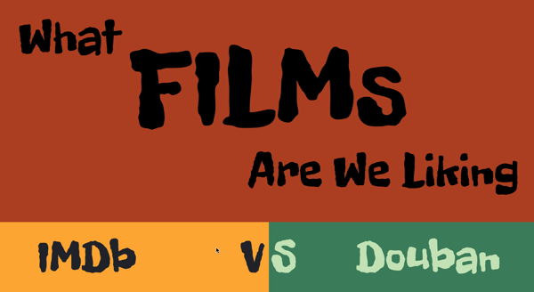

# What Films Are We Liking?   
Spring 2021 Critical Data &amp; Visualization Final Project  

### Project Name: What Films Are We Liking?  
#### Project Link: https://tinazhang226.github.io/cdv-student/projects/IMDb.VS.Douban/index.html

#### Description  
&emsp;The project is focused on the comparison between two giant movie databases, IMDb(which mainly focuses on the US market) and Douban(which mainly focuses on the Chinese market). Some stories behind the commonalities and differences they hold can be seen from the visualization based on the top 50 films dataset collected from both.

#### Process
&emsp;For the analyze of the data, I calculated the sentiment score for each emoji – if it is used more in negative tweets, then it is more negative than positive. Then, using Python's VADER and NLTK library, I get the text sentiment for each tweet. Other than that, I processed the data to get the average Position of each emoji, Combinations of emojis in each text, the number of times one emoji is Spammed in each text.  
When it comes to the process, I first spent a lot of time exploring the two databases by myself and discovered some interesting facts on my own. Later on, I tried to find some datasets that is suitable for my projects, but there are little resources for the Douban database, and the dataset about IMDb does not contain all the parts that I want to visualize. Therefore, I manually collected the data from the two databases.

&emsp;Later on, I use the d3.js library which we learned this semester to visualize my data and comparing the two movie databases from different angles. Although due to the limited time, the project does not completely reach my satisfaction, I think it is still an interesting project!

&emsp;Hope you enjoy it!  

  

#### Sources:  
IMDb Top 1000 Films:https://www.kaggle.com/omarhanyy/imdb-top-1000
